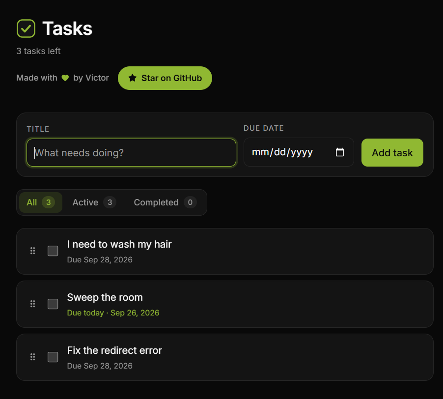

# Todo App

A dark-themed todo app built with Vite, React 19 and TypeScript. Todos persist to
`localStorage`, so there is no backend and no account.



## Features

- **Create, edit, complete and delete** todos, each rendered as its own card.
- **Due dates** that cannot be set in the past. Once set, a due date is allowed to
  fall behind the current day — that is what marks a task overdue.
- **Filtering** by all / active / completed, with live counts, plus a one-click
  "clear completed".
- **Drag to reorder** cards, or focus a card's handle and use the arrow keys.
- **Persistence** to `localStorage`, rehydrated on load.

## Getting started

```bash
pnpm install
pnpm dev
```

## Scripts

| Command | What it does |
| --- | --- |
| `pnpm dev` | Start the dev server with HMR |
| `pnpm build` | Typecheck with `tsc -b`, then build for production |
| `pnpm preview` | Serve the production build locally |
| `pnpm lint` | ESLint over the project |
| `pnpm test` | Jest unit tests |

## Project structure

```
src/
  types.ts               Domain types shared by everything below
  lib/
    todoStore.ts         Single source of truth: state, mutations, persistence
    storage.ts           localStorage read/write with a validating type guard
    dueDate.ts           Local-calendar date keys, parsing, formatting
    sanitize.ts          Text normalisation and length capping
    validateDraft.ts     Form validation rules
  hooks/
    useTodos.ts          Subscribes to the store, derives counts and filtering
  components/
    TodoForm.tsx         Add and edit
    FilterBar.tsx        Filter tabs and counts
    TodoCard.tsx         One card, including drag and keyboard reordering
    TodoList.tsx         Ordering, drag state, delete exit animation
  App.tsx                Composition and form/edit state
```

`todoStore` is a small external store that the UI reads through
`useSyncExternalStore`. Array order *is* display order, so reordering is just an
array move and needs no `order` field. Every write funnels through the store,
which is why sanitizing and persistence live there rather than in the components.

## Data model

```ts
interface Todo {
  id: string
  title: string
  completed: boolean
  dueDate: string | null // local 'YYYY-MM-DD'
  createdAt: number
}
```

`dueDate` is a local calendar date rather than a timestamp, so "due today" means
the same thing regardless of timezone. Those keys compare correctly as plain
strings, which keeps the overdue check trivial.

## Input handling and XSS

All text passes through `sanitizeText` before it is stored. It NFC-normalises the
input, strips zero-width and bidi formatting marks and C0/C1 control characters,
turns line separators into spaces, collapses whitespace runs, and caps the title
at 120 code points. Truncation is done by code point so an emoji is never cut in
half.

Titles are **not** html-escaped before storage, and that is deliberate. React
escapes every text node and attribute value on render, so escaping on the way in
would double-encode the data: a title of `<b>` would be saved as `&lt;b&gt;` and
then displayed literally as `&lt;b&gt;`.

The actual XSS risk in a React app is opting out of that escaping, so `eslint.config.js`
bans it outright:

- `dangerouslySetInnerHTML`
- `window.innerHTML` / `document.innerHTML` assignment
- `eval` and `new Function`

Sanitizing and that lint rule are complementary: the first keeps stored data
clean, the second removes the vector.

## Testing

Jest with `ts-jest` and the jsdom environment. 79 tests cover the date helpers,
the sanitizer, draft validation, storage round-tripping and error handling, and
every store mutation including reordering and no-op behaviour.

```bash
pnpm test
```

Tests live next to the code they cover (`src/lib/dueDate.test.ts`) and are
excluded from the production build via `tsconfig.app.json`.
